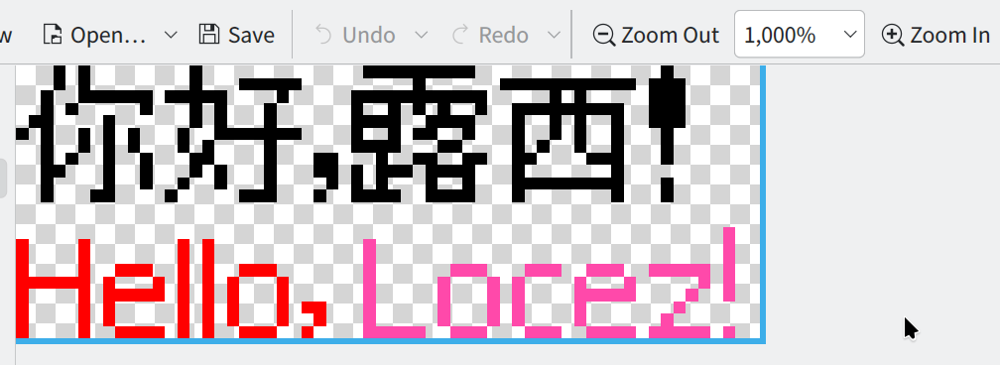

# bdf2surface

A crate to convert bdf font to sdl2 surface

# Example

```rust
use sdl2::surface::Surface;
use bdf2surface::{Color, Converter, Text};


let sdl_context = sdl2::init()?;
let _video_subsystem = sdl_context.video()?;
let path = "./resource/wqy_9pt.bdf";
let converter = Converter::new(path);

let texts = vec![
    Text("你好，露西！".to_string(), Color::RGB(0, 0, 0)),
    Text(
        "Hello,                    ".to_string(),
        Color::RGB(255, 0, 0),
    ),
    Text("Locez!".to_string(), Color::RGB(255, 73, 170)),
];
let surface = converter.render(&texts, 60).unwrap();
surface.save_bmp("output.bmp")?;
```
output.bmp




